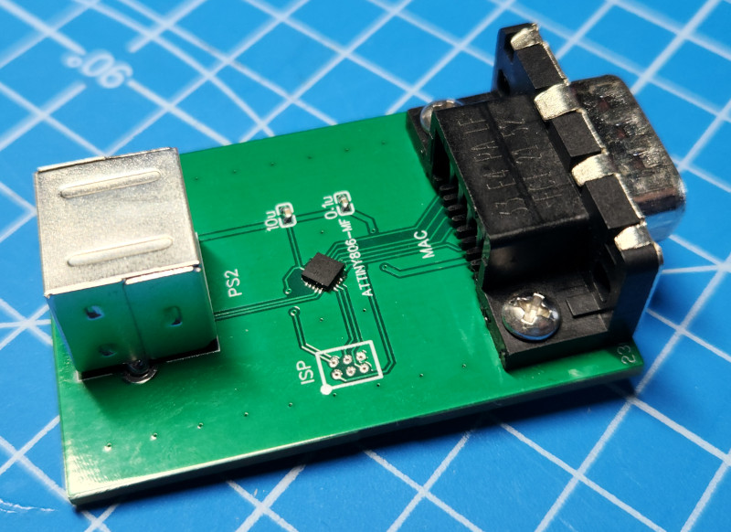

# PS/2 To Mac Plus Mouse Adapter

## About
This is a PS/2 to Mac Plus (or 128 or 512 or possibly Lisa) mouse adapter based on an ATtiny806 microcontroller. 

This sketch is a fork of [glitterkitty's Arduino-PS2-Mouse-to-Amiga-Adapter](https://github.com/glitterkitty/Arduino-PS2-Mouse-to-Amiga-Adapter). I've just modified this project to work with the [ATtin806](https://www.microchip.com/en-us/product/attiny806) using the Mac Plus mouse port DB9 pinout. 

## Hardware
The PCB is available [through OSHPark](https://oshpark.com/shared_projects/Ghm76ref). You can order a copy of the PCB through OSHPark or download the gerber files and order the PCB from some other location. The BOM is provided in the project description of the project on OSHPark. The ISP header on the PCB follows the [standard UPDI pinout](https://onlinedocs.microchip.com/pr/GUID-DDB0017E-84E3-4E77-AAE9-7AC4290E5E8B-en-US-4/index.html?GUID-9B349315-2842-4189-B88C-49F4E1055D7F), but includes the RX (pin 4) and TX (pin 5) of the 806's USART port allowing for serial debugging if needed. 

## Compiling & Programming

To compile this code you'll need to use the Arduino IDE and [megaTinyCore](https://github.com/SpenceKonde/megaTinyCore).

To program you'll need to use either [jtag2updi](https://github.com/SpenceKonde/jtag2updi) or [SerialUPDI](https://github.com/SpenceKonde/megaTinyCore#UPDI-Programming) along with a 2x6, 1.27mm pitch programming header interface. I have designed [a PCB for this which you get through OSHPark](https://oshpark.com/shared_projects/KFOWave7), but assembly is required. There may be other options out there such as [ElectronutLabs's PogoProg, Model D](https://gitlab.com/electronutlabs-public/ElectronutLabs-PogoProg).

## References
 
* [glitterkitty's Arduino-PS2-Mouse-to-Amiga-Adapter](https://github.com/glitterkitty/Arduino-PS2-Mouse-to-Amiga-Adapter)
* [megaTinCore - an Arduino core for tinyAVR 0/1/2 series microcontrollers](https://github.com/SpenceKonde/megaTinyCore)
* [Bus Mouse DB9 Pinouts](https://deskthority.net/wiki/Bus_mouse)
